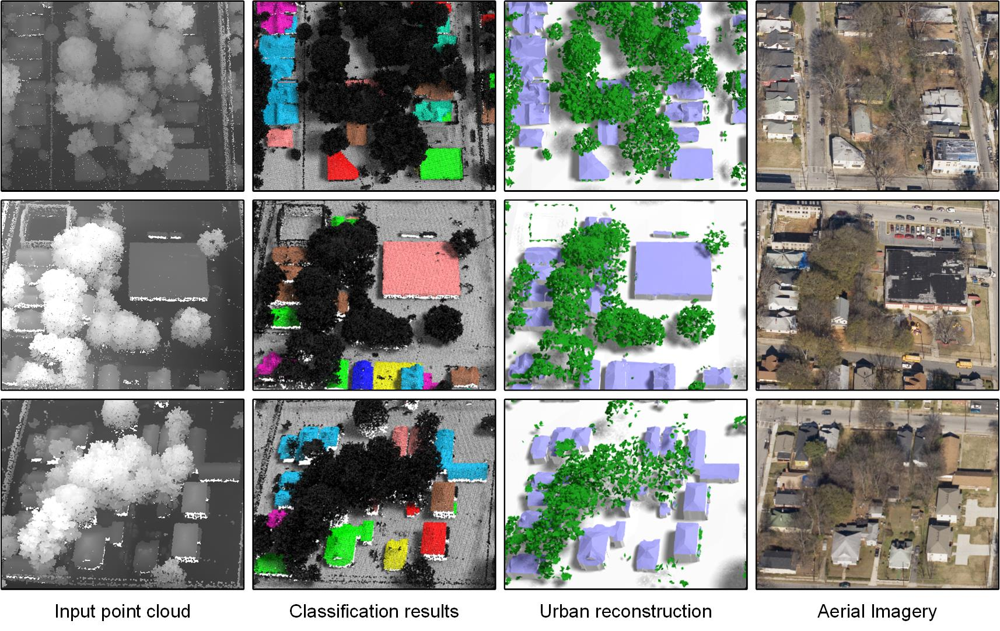

# UrbanReconstruction

Automatic 3D Urban Modeling from City-scale Aerial LiDAR Data

## Introduction

UrbanReconstruction is the research project I developed during my PhD at the University of Southern California a long time ago. The technique is based on my PhD thesis:

3D Urban Modeling from City-scale Aerial LiDAR Data  
Qian-Yi Zhou  
PhD Thesis (Advisor: Ulrich Neumann)

See the [project page](http://qianyi.info/urban.html) for a complete list of publications related to this project.

## Usage

The project is ancient. I am not intending to provide support. You are at your own risk.

For quick start, find the prebuilt package under the [prebuild-win32](prebuilt-win32) folder. The prebuilt package can also be downloaded from [Google Drive](https://drive.google.com/open?id=0B5PCxplTS-ZdQ2lkOGJpbERDZnc). It includes executables, testing data, detailed documentation, and a demo video. The executables run on Windows platform. If you work on Linux or OS X, [Wine](https://www.winehq.org/) may help you.

The [src](src) folder includes the source code of the entire project. The code was ancient. I developed it with Visual Studio 2008. A modern [Visual Studio](https://www.visualstudio.com/) *should* be able to convert the project into a modern format and compile it. There might be some OpenGL or GUI related code that causes compilation problems. However, this project is a pure console program except the visualization and debugging tool called "huma". If it causes problem, just remove it.

The [src_dualcontouring](src_dualcontouring) includes the source code of the [2.5D Dual Contouring](http://qianyi.info/docs/papers/eccv10_dualcontouring.pdf) paper. It is a duplicate of [src/BldRecons/DualContouring](src/BldRecons/DualContouring), but can be compiled standalone.

## License

The source code is released under the MIT license. You can do anything with the code with proper attribution. I developed this project in hope it will be useful. Please let me ([Qianyi.Zhou@gmail.com](mailto:Qianyi.Zhou@gmail.com)) and Professor Neumann ([uneumann@usc.edu](mailto:uneumann@usc.edu)) know if you are doing anything interesting with it.

See [LICENSE](LICENSE) file for details.

## Help Wanted

The code is in good shape, and I believe it is still useful somewhere. However, I do not have the bandwidth to maintain this project. If you are willing to contribute, [contact me](mailto:Qianyi.Zhou@gmail.com), or submit [issues](https://github.com/qianyizh/UrbanReconstruction/issues) and [pull requests](https://github.com/qianyizh/UrbanReconstruction/pulls).

The current most immediate enhancement is to migrate UrbanReconstruction into a CMake build system and make it cross-platform. Please contact me if you can provide help for this.
